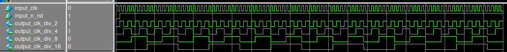

# Cloc devider

This device divide input clock signal to selected integer coefficients and give this signals to output.

<figure>
  
  <figcaption align="center" font-style="italic"> Picture 0.1 - Time diagramms clock divider </figcaption>
</figure>

The table 0.1 shows the signals owned by module clock divider

### *Table 0.1 - Signals clock devider* 
| Number   | type signals    | Name signals  | Description signals        |
|:--------:|:---------------:|:-------------:|:---------------------------|
|0         | wire            | clk           | input clock signal         |
|1         | wire            | n_rst         | input invert reset signal  |
|1         | wire            | divide_by_2   | output clock divided by 2  |
|1         | wire            | divide_by_4   | output clock divided by 4  |
|1         | wire            | divide_by_8   | output clock divided by 8  |
|1         | wire            | divide_by_16  | output clock divided by 16 |