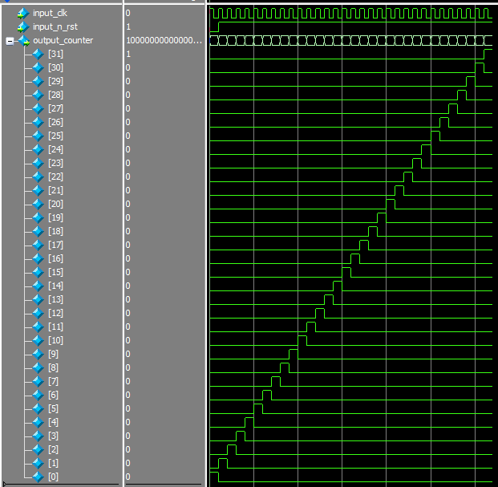

# Ring counter

A ring counter is a special type of application of the Serial IN Serial OUT Shift register.

<figure>
  
  <figcaption align="center" font-style="italic"> Picture 2.1 - Time diagramms ring counter </figcaption>
</figure>

The table 2.1 shows the signals owned by module ring counter

### *Table 2.1 - Signals ring counter* 
| Number   | type signals    | Name signals  | Description signals        |
|:--------:|:---------------:|:-------------:|:---------------------------|
|0         | wire            | clk           | input clock signal         |
|1         | wire            | n_rst         | input invert reset signal  |
|2         | bus             | out_ring      | output counter value       |

Result simulation in console:
```
# 00000000000000000000000000000001
# 00000000000000000000000000000010
# 00000000000000000000000000000100
# 00000000000000000000000000001000
# 00000000000000000000000000010000
# 00000000000000000000000000100000
# 00000000000000000000000001000000
# 00000000000000000000000010000000
# 00000000000000000000000100000000
# 00000000000000000000001000000000
# 00000000000000000000010000000000
# 00000000000000000000100000000000
# 00000000000000000001000000000000
# 00000000000000000010000000000000
# 00000000000000000100000000000000
# 00000000000000001000000000000000
# 00000000000000010000000000000000
# 00000000000000100000000000000000
# 00000000000001000000000000000000
# 00000000000010000000000000000000
# 00000000000100000000000000000000
# 00000000001000000000000000000000
# 00000000010000000000000000000000
# 00000000100000000000000000000000
# 00000001000000000000000000000000
# 00000010000000000000000000000000
# 00000100000000000000000000000000
# 00001000000000000000000000000000
# 00010000000000000000000000000000
# 00100000000000000000000000000000
# 01000000000000000000000000000000
# 10000000000000000000000000000000
```